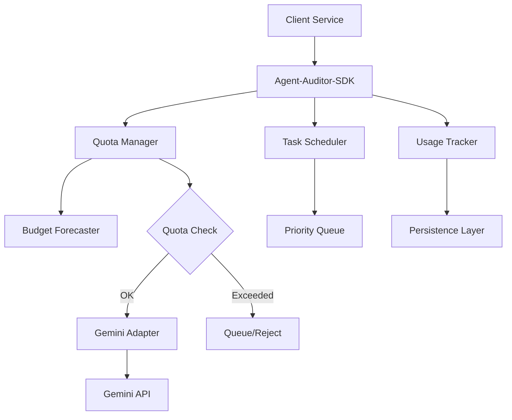

# Agent-Auditor-SDK Architecture

> Agent context artifact for the quota-aware AI scheduling library.

## Purpose

Platform-wide authority for AI quota tracking, predictive budgeting, and task orchestration across all AI-powered services.

## Technology Stack

- **Language**: Python 3.11+
- **Async**: asyncio structured concurrency
- **Storage**: SQLite (local), PostgreSQL (prod)
- **AI**: Gemini API adapter

## Directory Structure

```
├── src/agent_auditor/
│   ├── adapters/       # AI provider adapters (Gemini, etc.)
│   ├── quota/          # Quota tracking and forecasting
│   ├── scheduler/      # Task orchestration
│   ├── persistence/    # Database layer
│   └── cli/            # Command-line interface
├── tests/
└── docs/
```

## Component Graph



## API Surface

```python
from agent_auditor import QuotaManager, schedule_task

# Check quota before AI call
if await quota.can_execute("debate", tokens=1000):
    result = await schedule_task(my_ai_function)
```

## Integration Points

All AI-calling services MUST use this SDK.
