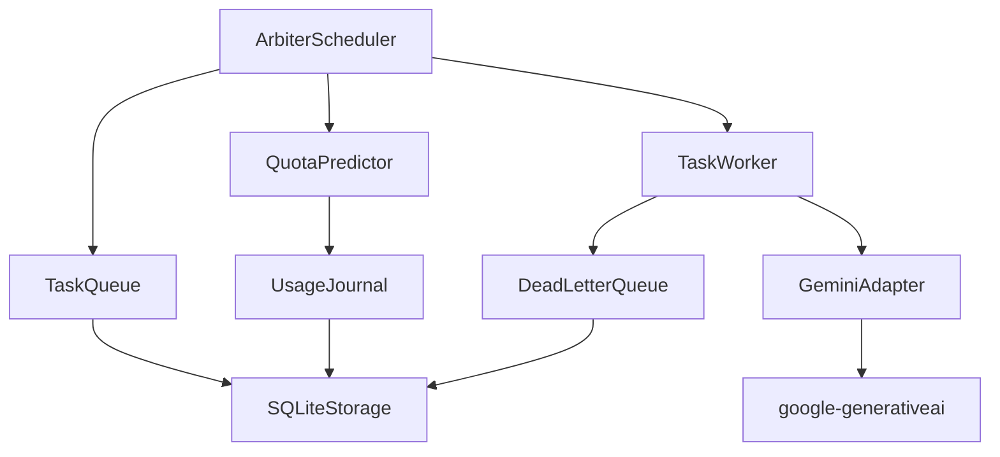

# Implementation Plan: Quota-Aware AI Scheduling

**Spec**: `specs/001-quota-aware-scheduling/spec.md`  
**Created**: 2026-02-03  
**Status**: Ready for Implementation

---

## Summary

Build a quota-aware SDK that schedules AI tasks while guaranteeing human priority. Uses Producer-Consumer pattern with SQLite persistence and google-generativeai SDK.

---

## Technical Context

| Aspect | Choice |
|--------|--------|
| **Language** | Python 3.11+ |
| **AI API** | google-generativeai SDK |
| **Persistence** | SQLite (stdlib sqlite3) |
| **Testing** | pytest + pytest-asyncio |
| **Concurrency** | asyncio Producer-Consumer |
| **Type Checking** | mypy --strict |
| **Linting** | ruff |

---

## API Limits (Free Tier)

| Limit | Value |
|-------|-------|
| RPM | 15 requests/minute |
| TPM | 1,000,000 tokens/minute |
| RPD | 1,500 requests/day |
| Human Reserve | 30% |

---

## Constitution Check Gate

| Principle | Compliance |
|-----------|------------|
| **I. Human Priority** | ✅ Priority queue with preemption |
| **II. Security-First** | ✅ Env vars only, no logging keys |
| **III. Async-First** | ✅ All I/O is async |
| **IV. ToS Compliance** | ✅ Respects limits, backoff |
| **V. TDD** | ✅ Tests before implementation |
| **VI. SOLID** | ✅ Producer-Consumer, SRP |
| **VII. 12-Factor** | ✅ Config via env, stateless |
| **VIII. DRY** | ✅ Shared utilities |

---

## Project Structure

```
Agent-Auditor-SDK/
├── pyproject.toml              # Package config
├── .specify/
│   └── memory/
│       └── constitution.md     # Project principles
├── specs/
│   └── 001-quota-aware-scheduling/
│       ├── spec.md             # Feature spec ✅
│       ├── plan.md             # This file ✅
│       └── tasks.md            # Task breakdown ✅
├── src/
│   └── agent_auditor/
│       ├── __init__.py         # Public API exports
│       ├── models.py           # Pydantic models
│       ├── scheduler.py        # ArbiterScheduler (producer)
│       ├── worker.py           # TaskWorker (consumer)
│       ├── queue.py            # TaskQueue + DeadLetterQueue
│       ├── quota.py            # QuotaPredictor + UsageJournal
│       ├── adapters/
│       │   └── gemini.py       # google-generativeai wrapper
│       ├── persistence/
│       │   └── sqlite.py       # SQLite storage layer
│       ├── security.py         # SecureKeyManager
│       └── __main__.py         # CLI entry point
├── features/                   # Black-box BDD tests
│   └── acceptance/
│       └── test_acceptance.py  # Given/When/Then scenarios
└── tests/                      # White-box unit/functional/integration
    ├── test_models.py          # Unit: Models
    ├── test_queue.py           # Unit: TaskQueue
    ├── test_scheduler.py       # Unit: ArbiterScheduler
    ├── test_quota.py           # Unit: QuotaPredictor
    └── conftest.py             # Shared fixtures
```

---

## Component Dependencies



---

## Implementation Order

1. **Models** — Data structures (no dependencies)
2. **Security** — Key management (no dependencies)
3. **Persistence** — SQLite layer (no dependencies)
4. **Queue** — TaskQueue + DeadLetterQueue (depends: Persistence)
5. **UsageJournal** — History tracking (depends: Persistence)
6. **QuotaPredictor** — Budget calculation (depends: UsageJournal)
7. **GeminiAdapter** — API wrapper (depends: Security)
8. **TaskWorker** — Consumer (depends: Queue, GeminiAdapter)
9. **ArbiterScheduler** — Producer (depends: Queue, QuotaPredictor, Worker)
10. **CLI** — Command-line interface (depends: Scheduler)

---

## Test Strategy

| Layer | Type | Framework |
|-------|------|-----------|
| Acceptance | BDD | pytest (Given/When/Then) |
| Unit | TDD | pytest + mocks |
| Integration | E2E | pytest-asyncio |

**Rule**: Tests MUST fail before implementation.

---

## Deliverables by User Story

| Story | Deliverables |
|-------|--------------|
| US1: Human Priority | `scheduler.submit()`, priority queue, preemption |
| US2: Predictive Budget | `QuotaPredictor`, `UsageJournal`, safe budget calc |
| US3: Background Tasks | `TaskWorker`, batch processing, dead-letter queue |
| US4: Dashboard | `get_status()`, CLI, HTTP endpoint |

---

## Risk Mitigation

| Risk | Mitigation |
|------|------------|
| API key exposure | SecureKeyManager, never log |
| Quota exhaustion | Persist & resume, 30% reserve |
| Task failures | Dead-letter queue, 3x retry |
| Data loss | SQLite persistence |
