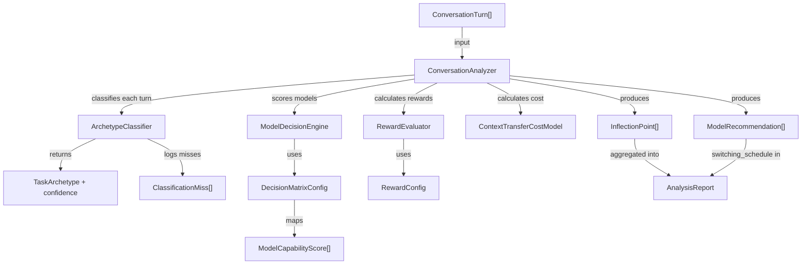

# Data Model: Conversation Auditor Models

**Feature**: 002-conversation-auditor-models
**Created**: 2026-02-07

## Entity Definitions

### TaskArchetype (Enum)

Classifies user prompt intent for model selection optimization.

| Value      | Description                                   |
| ---------- | --------------------------------------------- |
| PLANNING   | Design, architecture, roadmap prompts         |
| CODE_GEN   | Write/create/implement code prompts           |
| CODE_EDIT  | Fix/refactor/modify existing code             |
| REASONING  | Analyze/compare/evaluate/logical prompts      |
| SEARCH     | Find/locate/grep prompts                      |
| REVIEW     | Review/audit/validate prompts                 |
| CHAT       | General Q&A, greetings, simple queries        |
| MULTI_STEP | Complex multi-part tasks                      |
| UNKNOWN    | No pattern matched with sufficient confidence |

---

### ConversationTurn (Pydantic BaseModel)

A single message in a conversation.

| Field     | Type           | Required | Default           | Description                                  |
| --------- | -------------- | -------- | ----------------- | -------------------------------------------- |
| role      | str            | Yes      | —                 | `"user"` or `"assistant"`                    |
| content   | str            | Yes      | —                 | Message text                                 |
| model     | Optional[str]  | No       | None              | Model used (assistant turns only)            |
| timestamp | datetime       | No       | `datetime.utcnow` | When the turn occurred                       |
| metadata  | Dict[str, Any] | No       | `{}`              | Extensible metadata (e.g., `has_tool_state`) |

---

### ModelCapabilityScore (Pydantic BaseModel)

Normalized capability profile for a single AI model.

| Field          | Type  | Constraints | Description                        |
| -------------- | ----- | ----------- | ---------------------------------- |
| quality        | float | [0.0, 1.0]  | Response quality score             |
| speed          | float | [0.0, 1.0]  | Response speed score               |
| cost           | float | [0.0, 1.0]  | Cost efficiency (1.0 = cheapest)   |
| context_window | int   | ≥ 0         | Context window size in tokens      |
| tool_use       | float | [0.0, 1.0]  | Tool use capability score          |
| code           | float | [0.0, 1.0]  | Code generation/editing capability |

---

### DecisionMatrixConfig (Pydantic BaseModel)

Configuration container for model capabilities and archetype weights.

| Field             | Type                                  | Description                    |
| ----------------- | ------------------------------------- | ------------------------------ |
| models            | Dict[str, ModelCapabilityScore]       | Model name → capability scores |
| archetype_weights | Dict[TaskArchetype, Dict[str, float]] | Archetype → dimension weights  |

**Validation**: Each archetype must have weights for: `quality`, `speed`, `cost`, `tool_use`, `code`.

---

### InflectionPoint (Pydantic BaseModel)

A user prompt annotated with analysis metadata.

| Field                 | Type          | Default | Description                                     |
| --------------------- | ------------- | ------- | ----------------------------------------------- |
| turn_index            | int           | —       | Position in the conversation turn list          |
| archetype             | TaskArchetype | —       | Classified task type                            |
| confidence            | float         | —       | Classification confidence [0.0, 1.0]            |
| model_used            | Optional[str] | None    | Model that was actually used                    |
| optimal_model         | Optional[str] | None    | Best model per counterfactual analysis          |
| reward_score          | float         | 0.0     | Actual reward for the model used                |
| counterfactual_reward | float         | 0.0     | Best possible reward                            |
| delta                 | float         | 0.0     | Improvement potential (counterfactual - actual) |
| reasoning             | Optional[str] | None    | Human-readable explanation                      |

---

### ModelRecommendation (Pydantic BaseModel)

A specific turn-level switching recommendation.

| Field             | Type  | Description                           |
| ----------------- | ----- | ------------------------------------- |
| turn_index        | int   | Conversation turn to switch at        |
| recommended_model | str   | Model to switch to                    |
| confidence        | float | Recommendation confidence             |
| reasoning         | str   | Why this switch is recommended        |
| expected_reward   | float | Expected total reward after switching |

---

### AnalysisReport (Pydantic BaseModel)

Complete output of a retrospective analysis.

| Field                 | Type                      | Default           | Description                    |
| --------------------- | ------------------------- | ----------------- | ------------------------------ |
| conversation_id       | str                       | —                 | Unique conversation identifier |
| total_turns           | int                       | —                 | Number of turns analyzed       |
| inflection_points     | List[InflectionPoint]     | —                 | Per-turn analysis data         |
| optimal_reward        | float                     | —                 | Best possible total reward     |
| actual_reward         | float                     | —                 | Actual total reward achieved   |
| potential_improvement | float                     | —                 | Improvement percentage         |
| cost_savings_estimate | float                     | —                 | Estimated cost savings index   |
| switching_schedule    | List[ModelRecommendation] | —                 | Recommended model switches     |
| analyzed_at           | datetime                  | `datetime.utcnow` | When analysis was performed    |

---

### ClassificationMiss (Pydantic BaseModel)

Logged low-confidence classification for improvement tracking.

| Field               | Type                    | Default           | Description                          |
| ------------------- | ----------------------- | ----------------- | ------------------------------------ |
| id                  | UUID                    | `uuid4()`         | Unique miss identifier               |
| prompt_snippet      | str                     | —                 | First 100 chars of the prompt        |
| predicted_archetype | TaskArchetype           | —                 | What the classifier predicted        |
| confidence          | float                   | —                 | How confident the prediction was     |
| timestamp           | datetime                | `datetime.utcnow` | When the miss was logged             |
| corrected_archetype | Optional[TaskArchetype] | None              | Human-corrected label (for training) |

---

### RewardConfig (Pydantic BaseModel)

Tunable weights for the composite reward function.

| Field                 | Type  | Default | Description                       |
| --------------------- | ----- | ------- | --------------------------------- |
| w_quality             | float | 0.5     | Weight for quality reward (R1)    |
| w_efficiency          | float | 0.3     | Weight for efficiency reward (R2) |
| w_context             | float | 0.2     | Weight for context reward (R3)    |
| alpha_speed           | float | 0.4     | Efficiency sub-weight: speed      |
| beta_cost             | float | 0.6     | Efficiency sub-weight: cost       |
| gamma_context_penalty | float | 0.3     | Severity of context loss penalty  |

## Entity Relationships

## Existing Model Modifications

### UsageEntry (in `src/agent_auditor/models.py`)

**Add field**: `conversation_id: Optional[str] = None`

This enables the `UsageJournal.query_by_conversation()` method to correlate usage data with analysis results. Default `None` maintains backward compatibility.
