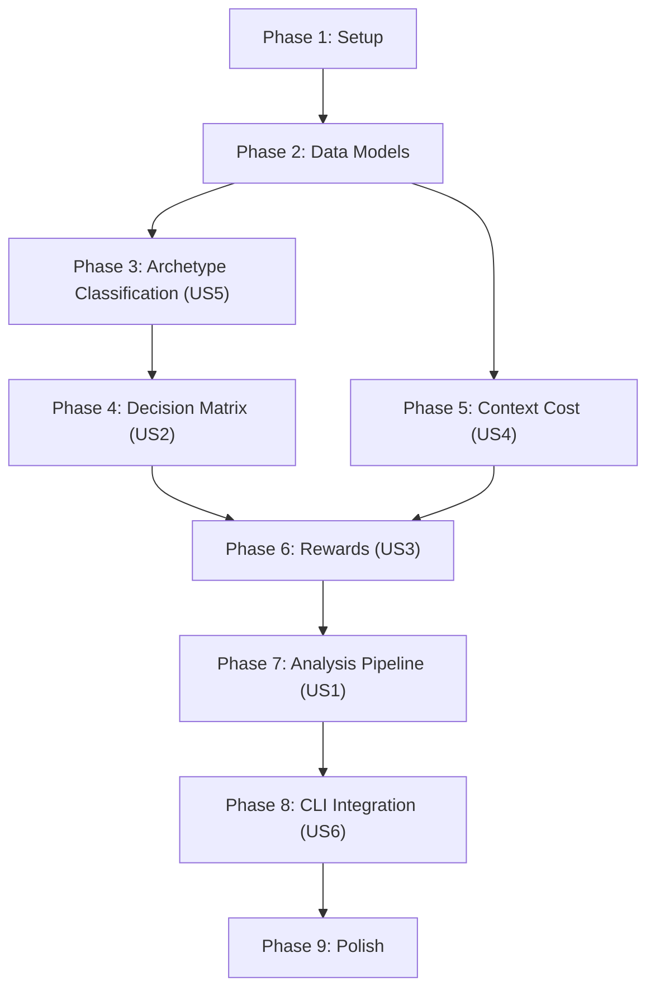

# Tasks: Conversation Auditor Models

**Feature**: 002-conversation-auditor-models
**Branch**: `002-conversation-auditor-models`
**Generated**: 2026-02-07
**Spec**: [spec.md](file:///c:/Users/bfoxt/vindicta-platform/Agent-Auditor-SDK/specs/002-conversation-auditor-models/spec.md)
**Plan**: [plan.md](file:///c:/Users/bfoxt/vindicta-platform/Agent-Auditor-SDK/specs/002-conversation-auditor-models/plan.md)

---

## Phase 1: Setup

- [ ] T001 Create analysis module directory at `src/agent_auditor/analysis/`
- [ ] T002 Create analysis module `__init__.py` at `src/agent_auditor/analysis/__init__.py`
- [ ] T003 Add `conversation_id: str | None = None` field to `UsageEntry` dataclass in `src/agent_auditor/models.py`

## Phase 2: Foundational — Data Models (FR-001, FR-003)

- [ ] T004 [P] Implement `TaskArchetype` enum in `src/agent_auditor/analysis/models.py` with values: PLANNING, CODE_GEN, CODE_EDIT, REASONING, SEARCH, REVIEW, CHAT, MULTI_STEP, UNKNOWN
- [ ] T005 [P] Implement `ConversationTurn` Pydantic model in `src/agent_auditor/analysis/models.py` with fields: role, content, model, timestamp, metadata
- [ ] T006 [P] Implement `ModelCapabilityScore` Pydantic model in `src/agent_auditor/analysis/models.py` with normalized fields: quality, speed, cost, context_window, tool_use, code
- [ ] T007 [P] Implement `InflectionPoint` Pydantic model in `src/agent_auditor/analysis/models.py` with fields: turn_index, archetype, confidence, model_used, optimal_model, reward_score, counterfactual_reward, delta, reasoning
- [ ] T008 [P] Implement `ModelRecommendation` Pydantic model in `src/agent_auditor/analysis/models.py` with fields: turn_index, recommended_model, confidence, reasoning, expected_reward
- [ ] T009 [P] Implement `ClassificationMiss` Pydantic model in `src/agent_auditor/analysis/models.py` with fields: id, prompt_snippet, predicted_archetype, confidence, timestamp, corrected_archetype
- [ ] T010 [P] Implement `RewardConfig` Pydantic model in `src/agent_auditor/analysis/models.py` with fields: w_quality, w_efficiency, w_context, alpha_speed, beta_cost, gamma_context_penalty
- [ ] T011 [P] Implement `AnalysisReport` Pydantic model in `src/agent_auditor/analysis/models.py` with fields per data-model.md
- [ ] T012 [P] Implement `DecisionMatrixConfig` Pydantic model in `src/agent_auditor/analysis/models.py` with fields: models dict, archetype_weights dict

> **Dependency**: T004–T012 are parallelizable (all in one file, independent definitions). Must complete before Phase 3+.

## Phase 3: User Story 5 — Archetype Classification (P1)

> **Goal**: Classify user prompts into task archetypes using regex heuristics.
> **Test Criteria**: Known prompts for CODE_GEN, REASONING, CHAT return correct archetype with confidence ≥ 0.5; unknown prompts return UNKNOWN with low confidence and log a miss.

- [ ] T013 [US5] Implement `ArchetypeClassifier` class in `src/agent_auditor/analysis/archetypes.py` with regex patterns for all 9 archetypes per FR-001
- [ ] T014 [US5] Implement `ArchetypeClassifier.classify()` method returning `Tuple[TaskArchetype, float]` per api-contracts.md
- [ ] T015 [US5] Implement classification miss logging in `ArchetypeClassifier` — low-confidence predictions (< threshold) logged to `misses` list per FR-002
- [ ] T016 [US5] Write unit tests in `tests/unit/test_archetypes.py` covering: known patterns, unknown prompts, miss logging, confidence thresholds

## Phase 4: User Story 2 — Model Decision Matrix (P0)

> **Goal**: Score models against archetypes using a multi-dimensional capability matrix.
> **Test Criteria**: `score_model()` returns normalized [0.0, 1.0] scores; CODE_GEN archetype ranks code-focused models highest; custom config overrides defaults.
> **Depends on**: Phase 2 (models), Phase 3 (TaskArchetype)

- [ ] T017 [US2] Implement `ModelDecisionEngine` class in `src/agent_auditor/analysis/decision_matrix.py` with default model data for Gemini 2.5 Pro, Gemini 2.5 Flash, Gemini 2.0 Flash, Claude 4 Opus, Claude 4 Sonnet, generic OSS per FR-003
- [ ] T018 [US2] Implement `ModelDecisionEngine.score_model()` with archetype-weighted dimension scoring per FR-004
- [ ] T019 [US2] Implement `ModelDecisionEngine.get_optimal_model()` returning `Tuple[str, float]` for best-scoring model per archetype
- [ ] T020 [US2] Implement `ModelDecisionEngine.list_models()` returning registered model names
- [ ] T021 [US2] Implement custom config injection via `DecisionMatrixConfig` parameter per FR-010
- [ ] T022 [US2] Write unit tests in `tests/unit/test_decision_matrix.py` covering: default scoring, archetype weighting, custom config injection, unknown model handling

## Phase 5: User Story 4 — Context Switching Cost (P1)

> **Goal**: Quantify the penalty for switching models mid-conversation.
> **Test Criteria**: Same-provider switches produce lower cost than cross-provider; tool state adds penalty; loss ratio capped at 0.4.
> **Depends on**: Phase 2 (models)

- [ ] T023 [US4] Implement `ContextTransferCostModel` class in `src/agent_auditor/analysis/context_cost.py` per FR-006
- [ ] T024 [US4] Implement `calculate_loss_ratio()` with provider detection, tier penalty, cross-provider penalty, tool state penalty, and cap at 0.4
- [ ] T025 [US4] Write unit tests in `tests/unit/test_context_cost.py` covering: same-provider, cross-provider, tool state, cap enforcement

## Phase 6: User Story 3 — Reward-Based Scoring (P0)

> **Goal**: Calculate composite reward scores balancing quality, efficiency, and context.
> **Test Criteria**: Total reward is weighted sum of R1+R2+R3; context switches reduce R3; custom weights shift priorities.
> **Depends on**: Phase 4 (ModelDecisionEngine), Phase 5 (ContextTransferCostModel)

- [ ] T026 [US3] Implement `RewardEvaluator` class in `src/agent_auditor/analysis/rewards.py` per FR-005
- [ ] T027 [US3] Implement `calculate_quality_reward()` (R1) using ModelDecisionEngine archetype scoring
- [ ] T028 [US3] Implement `calculate_efficiency_reward()` (R2) as weighted speed + cost
- [ ] T029 [US3] Implement `calculate_context_reward()` (R3) with context loss penalty per FR-006
- [ ] T030 [US3] Implement `calculate_total_reward()` composing R1, R2, R3 with configurable weights
- [ ] T031 [US3] Write unit tests in `tests/unit/test_rewards.py` covering: individual R1/R2/R3 components, composite total, custom weight overrides

## Phase 7: User Story 1 — Retrospective Analysis Pipeline (P0)

> **Goal**: Full orchestration pipeline processing conversation turns into structured analysis reports.
> **Test Criteria**: 6-turn mixed conversation produces ≥1 inflection point; report includes switching schedule; improvement percentage > 0% for suboptimal model usage.
> **Depends on**: Phase 3, 4, 5, 6 (all components)

- [ ] T032 [US1] Implement `ConversationAnalyzer` class in `src/agent_auditor/analysis/analyzer.py` per FR-007
- [ ] T033 [US1] Implement `ConversationAnalyzer.analyze()` pipeline: classify → score actual → score counterfactual → calculate delta → build inflection points per FR-007
- [ ] T034 [US1] Implement switching schedule generation with significance threshold (delta > 0.02) per FR-009
- [ ] T035 [US1] Implement `AnalysisReport` construction with improvement percentage and cost savings estimate per FR-008
- [ ] T036 [US1] Write unit tests in `tests/unit/test_analyzer.py` covering: mixed transcript analysis, single-model conversation, empty turns validation
- [ ] T037 [US1] Write component test in `tests/component/test_analysis_pipeline.py` — end-to-end pipeline with sample 6-turn transcript validating SC-001

## Phase 8: User Story 6 — CLI Integration (P2)

> **Goal**: CLI `analyze` subcommand with text and JSON output.
> **Test Criteria**: `--file transcript.json` produces readable text output; `--format json` produces valid AnalysisReport JSON.
> **Depends on**: Phase 7 (ConversationAnalyzer)

- [ ] T038 [US6] Add `analyze` subcommand to argument parser in `src/agent_auditor/__main__.py` with `--file` and `--format` options per FR-011
- [ ] T039 [US6] Implement `analyze_command()` function: load transcript JSON, build ConversationTurn list, run analyzer, format output
- [ ] T040 [US6] Implement text output formatter for human-readable analysis summary
- [ ] T041 [US6] Implement JSON output formatter using AnalysisReport.model_dump_json()
- [ ] T042 [US6] Write unit tests for CLI analyze command in `tests/unit/test_cli_analyze.py` covering: text output, JSON output, missing file error

## Phase 9: Polish & Cross-Cutting Concerns

- [ ] T043 Add `query_by_conversation()` method to `UsageJournal` in `src/agent_auditor/usage_journal.py` per FR-012
- [ ] T044 Update analysis module exports in `src/agent_auditor/analysis/__init__.py` — export all public classes
- [ ] T045 Update SDK `__init__.py` at `src/agent_auditor/__init__.py` to include `ConversationAnalyzer` in `__all__`
- [ ] T046 Add analysis test fixtures to `tests/conftest.py` — sample transcripts, analyzer instance, classifier instance
- [ ] T047 Run `uv run ruff check src/agent_auditor/analysis/` and fix all lint errors
- [ ] T048 Run `uv run mypy src/agent_auditor/analysis/` and fix all type errors
- [ ] T049 Run full test suite `uv run pytest tests/ -v` and verify zero failures

---

## Dependency Graph

## Summary

| Metric                      | Value               |
| --------------------------- | ------------------- |
| **Total Tasks**             | 49                  |
| **Setup Tasks**             | 3                   |
| **Foundational Tasks**      | 9                   |
| **US5 (Classification)**    | 4                   |
| **US2 (Decision Matrix)**   | 6                   |
| **US4 (Context Cost)**      | 3                   |
| **US3 (Rewards)**           | 6                   |
| **US1 (Analysis Pipeline)** | 6                   |
| **US6 (CLI)**               | 5                   |
| **Polish Tasks**            | 7                   |
| **Parallelizable Tasks**    | 13                  |
| **MVP Scope**               | Phase 1–7 (US1–US5) |

## Implementation Strategy

1. **MVP First**: Phases 1–7 deliver the core analysis pipeline. Phase 8 (CLI) and Phase 9 (polish) are incremental.
2. **Bottom-Up Build**: Data models → classifiers → scorers → orchestrator → CLI.
3. **Red-Green-Refactor**: Each test task precedes its implementation tasks (within the same phase). Run tests, see red, implement, see green.
4. **Incremental Delivery**: Each phase is independently testable. Ship the models and classifiers before the full pipeline is wired up.
